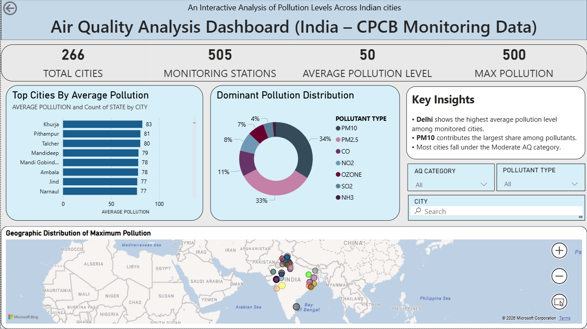

Air Quality Analysis Dashboard – India (CPCB Monitoring Data)

Project Overview
This project presents an interactive Power BI dashboard analyzing air pollution levels across Indian cities using CPCB monitoring data.
The dashboard provides insights into top polluted cities, dominant pollutants, pollution categories, and geographic distribution of pollution levels.

## Dashboard Preview

## Objectives

- Identify cities with highest average pollution levels  
- Determine dominant pollutant distribution  
- Analyze pollution category patterns  
- Visualize geographic spread of maximum pollution  
- Enable interactive filtering by city and pollutant type

## Tools & Technologies Used

- Power BI  
- DAX (Basic Measures)  
- Data Cleaning & Transformation  
- Data Visualization  

Key Features
- KPI indicators (Total Cities, Monitoring Stations, Avg Pollution, Max Pollution)
- Top Cities by Average Pollution (Bar Chart)
- Dominant Pollutant Distribution (Donut Chart)
- Geographic Distribution of Maximum Pollution (Map Visualization)
- Interactive slicers for filtering
- Insight summary panel

Key Insights
- Delhi shows the highest average pollution level among monitored cities.
- PM10 contributes the largest share among pollutants.
- Most cities fall under the Moderate AQ category.

Dataset Information
Source: CPCB Monitoring Data  
Type: Cross-sectional dataset (single-day pollution analysis)

## 📌 Author
Sindhu J  
Aspiring Data Analyst | Power BI | Data Visualization
